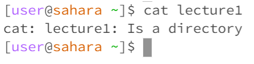

```cd```
1. - 
   - The working directory when the command was run was in the default home directory
   - I got that output because when you have ```cd``` without any arguments, it will take you back to the home directory. Since I was already in the home directory the command did not do anything(```cd``` = change directory)
   - The output is not an error.
2. - 
   - The working directory when the command was run was in the default home directory
   - I got this output because I ```cd```(change directory) to the lecture1 directory. Therefore, any command I do after will be within the lecture1 working directory.
   - The output is not an error
3. - 
   - The working directory when the command was run was in the default home directory
   - I got this output because you can only ```cd``` into directories and not files. Therefore, the output tells us that the file path is not a directory.
   - The output is an error because it is looking for a path to a directory rather than a file.
  
```ls```
1. - 
   - The working directory when the command was run was in the default home directory
   - I got this output because ```ls``` stands for "list files" and within my default home directory, the only file or directory that is present is "lecture1"
   - The output is not an error
2. - 
   - The working directory when the command was run was in the default home directory
   - I got this output because ```ls``` is listing the files within the lecture1 directory. So therefore the files that show up are present in the lecture1 working directory
   - The output is not an error
3. - 
   - The working directory when the command was run was in the default home directory
   - I got this output because when I am calling ```ls``` to the pathway, the only file that is present is the one I called within the path.
   - This is not an error


```cat```
1. - 
   - The working directory when the command was run was in the default home directory
   - I got this output because when you call ```cat``` in the terminal window with no arguments it will wait until the user types something and it will read the same output back. The only way to exit this command is to do control c.
   - This output is an error because it is an infinite loop and it is waiting for the user to enter an input and it will give a standard output as a result based off of what the user types and the user needs to type control C to exit out of the command.
2. - 
   - The working directory when the command was run was in the default home directory
   - I got this output because when you run ```cat```, you need to put a file after so that the data and content can be read. However, "lecture1" is a directory and not a file so there is no content or data that can be read
   - This output is an error because a file needs to be passed on with ```cat``` in order for the data and content to be read.
3. - 
   - The working directory when the command was run was in the default home directory
   - I got this output because when I called cat to the file I called the command with, it printed the content of the txt file which is "Hello World!".
   - This is not an error
