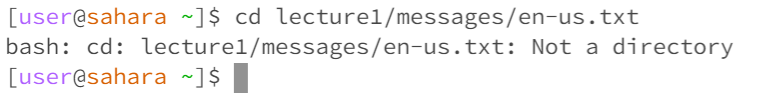
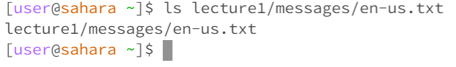
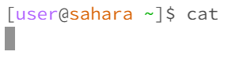
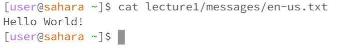

```cd```
1. - 
   - The working directory when the command was run was in the default home directory
   - I got that output because I need to include a pathway to a directory in order to change the directory(```cd``` = change directory)
   - The output is not an error
2. - 
   - The working directory when the command was run was in the default home directory.
   - I got this output because I ```cd```(change directory) to the lecture1 directory. Therefore, any command I do after will be within the lecture1 working directory.
   - The output is not an error
3. - 
   - Thr working directory when the command was run was in the default home directory
   - I got this output because you can only ```cd``` into directories and not files. Therefore, the output tells us that the file path is not a directory.
   - The output is not an error
  
```ls```
1. - 
   - The working directory when the command was run was in the default home directory
   - I got this output because ```ls``` stands for "list files" and within my default home directory, the only file that is present is "lecture1"
   - The output is not an error
2. - 
   - The working directory when the command was run was in the default home directory
   - I got this output because ```ls``` is listing the files within the lecture1 directory. So therefore the files that show up are present in the lecture1 working directory
   - The output is not an error
3. - 
   - The working directory when the command was run was in the default home directory
   - I got this output because when I am calling ```ls``` to the pathway, the only file that is present is the one I called within the path.
   - This is not an error


```cat```
1. - 
   - The working directory when the command was run was in the default home directory
   - I got this output because there is a runtime error with the command "```cat```". When you call ```cat``` in the terminal window, you need to include a file after it so that it can read the data and content of the file.
   - This output is an error
2. - 
   - The working directory when the command was run was in the default home directory
   - I got this output because when you run ```cat```, you need to put a file after so that the data and content can be read. However, "lecture1" is a directory and not a file so there is no content or data that can be read
   - This output is not an error
3. - 
   - The working directory when the command was run was in the default home directory
   - I got this output because when I called cat to the file I called the command with, it printed the content of the txt file which is "Hello World!".
   - This is not an error
