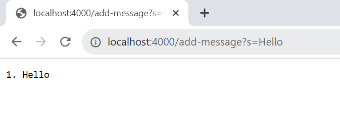
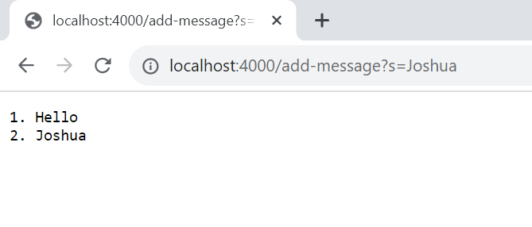

Part 1
CODE
```
import java.io.IOException;
import java.net.URI;

class Handler implements URLHandler {
    // The one bit of state on the server: a number that will be manipulated by
    // various requests.
    int count = 1;
    int x = 1;
    StringBuilder result = new StringBuilder();

    public String handleRequest(URI url) {
        if (url.getPath().contains("/add-message")) {
            String[] parameters = url.getQuery().split("=");

            if (parameters[0].equals("s")) {

                result.append(count).append(". ").append(parameters[1]).append("\n");

                count++;

                return result.toString();
            }
        }
        return "404 Not Found!";
    
    }
}

class StringServer {
    public static void main(String[] args) throws IOException {
        if(args.length == 0){
            System.out.println("Missing port number!");
            return;
        }

        int port = Integer.parseInt(args[0]);

        Server.start(port, new Handler());
    }
}
```
SCREENSHOTS


