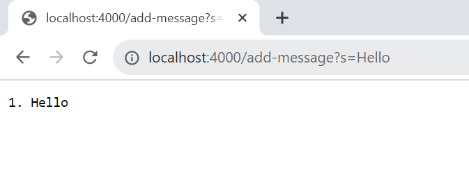
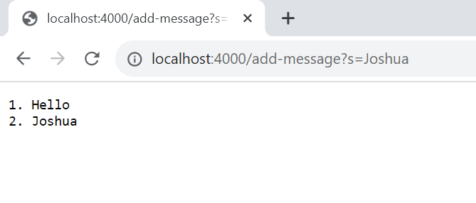
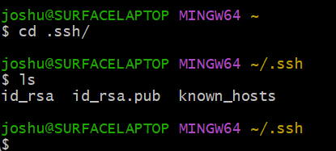
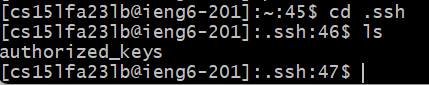
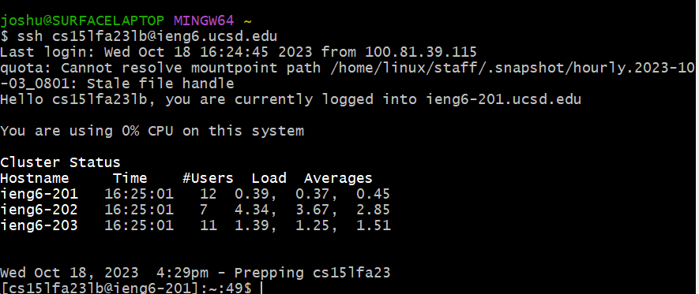

**Part 1**<br>
CODE
```
import java.io.IOException;
import java.net.URI;

class Handler implements URLHandler {
    // The one bit of state on the server: a number that will be manipulated by
    // various requests.
    int count = 1;
    StringBuilder result = new StringBuilder();

    public String handleRequest(URI url) {
        if (url.getPath().contains("/add-message")) {
            String[] parameters = url.getQuery().split("=");

            if (parameters[0].equals("s")) {

                result.append(count).append(". ").append(parameters[1]).append("\n");

                count++;

                return result.toString();
            }
        }
        return "404 Not Found!";
    
    }
}

class StringServer {
    public static void main(String[] args) throws IOException {
        if(args.length == 0){
            System.out.println("Missing port number!");
            return;
        }

        int port = Integer.parseInt(args[0]);

        Server.start(port, new Handler());
    }
}
```
SCREENSHOTS<br>

- In my code, the following methods are being called: ```main(String[] args)```,```Integer.parseInt(String s)```,```Server.start(int port, URLHandler handler)```,```StringBuilder()```,```handleRequest(URI url)```,```url.getPath().contains(CharSequence s)```,```url.getQuery().split(String regex)```,```parameters[0].equals(Object anObject)```,```result.append(int i).append(String s).append(String s).append(String s)```,```result.toString()```
- For the methods, the following are the relevant arguments: ```main({"4000"})```,```Integer.parseInt("4000")```,```Server.start(4000, new Handler)```,```StringBuilder()```,```handleRequest(/add-message?s=Hello)```,```url.getPath().contains("/add-message")```,```url.getQuery().split("=")```,```parameters[0].equals("s")```,```result.append(1).append(". ").append("Hello").append("\n")```,```result.toString()```. The value of the relevant fields include int count = 1, StringBuilder result = new StringBuilder().  
- From this specific request, the value of count increments by 1 after the user ```/add-message```. So the value of count is 2 after the ```/add-message``` is ran. The result Stringbuilder was empty before the request and now has the content of the message with the message number and a new line is created after.<br>

- In my code, the following methods are being called: ```main(String[] args)```,```Integer.parseInt(String s)```,```Server.start(int port, URLHandler handler)```,```StringBuilder()```,```handleRequest(URI url)```,```url.getPath().contains(CharSequence s)```,```url.getQuery().split(String regex)```,```parameters[0].equals(Object anObject)```,```result.append(int i).append(String s).append(String s).append(String s)```,```result.toString()```
- For the methods, the following are the relevant arguments: ```main({"4000"})```,```Integer.parseInt("4000")```,```Server.start(4000, new Handler)```,```StringBuilder()```,```handleRequest(/add-message?s=Hello)```,```url.getPath().contains("/add-message")```,```url.getQuery().split("=")```,```parameters[0].equals("s")```,```result.append(2).append(". ").append("Joshua").append("\n")```,```result.toString()```. The value of the relevant fields include int count = 1, StringBuilder result = new StringBuilder().  
- From this specific request, the value of count increments by 1 after the user ```/add-message```. So the value of count was 2 and is 3 after the ```/add-message``` is ran. The result Stringbuilder had the content of the first message before the request and now has the content of the second message with the message number(2) and a new line is created after.

**Part 2**<br>
- 
- 
- 

**Part 3**<br>
Something I learned from lab that I did not know before was that we can access the remote server through our own ieng6 accounts. After using EdStem for lab last week and logging into the remote server on there, I was fascinated by the fact that I can do that on my computer locally by using Git Bash. I was also amazed by the fact that we can setup our ieng6accounts to automatically login without prompting for password when we ssh into the server.
