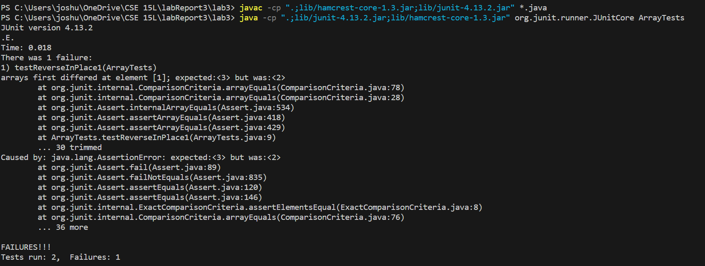

**Part 1**<br>
Bug: reverseInPlace() in ArrayExamples

- 
```
	@Test 
	public void testReverseInPlace1() {
    int[] input1 = {3, 2};
    ArrayExamples.reverseInPlace(input1);
    assertArrayEquals(new int[]{2, 3}, input1);
	}
```
- 
```
	@Test 
	public void testReverseInPlace2() {
    int[] input1 = {3};
    ArrayExamples.reverseInPlace(input1);
    assertArrayEquals(new int[]{3}, input1);
	}
```
  - 
  - 
