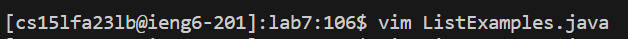
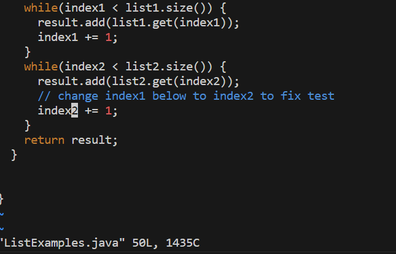
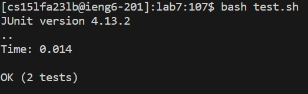
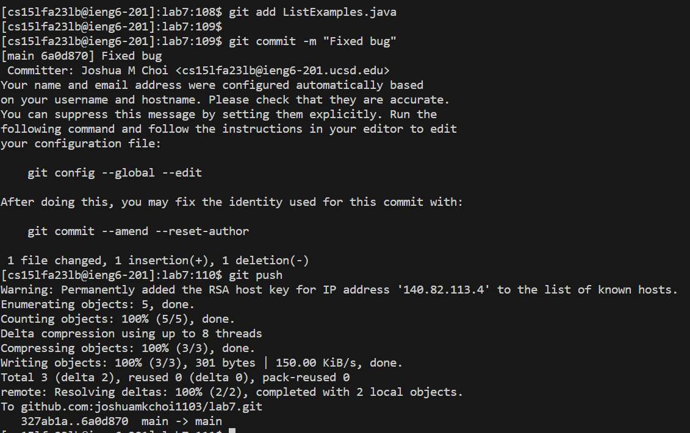

**LAB REPORT 4**
<br>
**Step 4**<br>
<br>
```ssh<Space>cs15lfa23lb@ieng6-201.ucsd.edu<Enter>```<br>
ssh into the ieng6 server using cse 15l specific account. Didn't use any shortcuts here.<br>
<br>
**Step 5**<br>
<br>
```git<Space>clone<Space><Ctrl-V><Enter>```<br>
The ssh github repository link was copied onto the clipboard so I did ```<Ctrl-V>``` to paste this link: **git@github.com:joshuamkchoi1103/lab7.git** to clone the forked repository<br>
<br>
**Step 6**<br>
<br>
```cd<Space>l<Tab><Enter>```, ```bash<Space>t<Tab><Enter>```<br>
The first use of ```<Tab>``` completed the directory name(```lab7```) I wanted to ```cd``` into. The second use of ```<Tab>``` completed the name of the bash file(```test.sh```) I wanted to run.<br>
<br>
**Step 7**<br>
<br>
<br>
```vim<Space>Lis<Tab>.<Tab><Enter>```, ```i<left><left><left><left><left><Backspace>2<Esc>:wq<Enter>```<br>
The first use of ```<Tab>``` completed the filename to ```ListExamples``` and then I had to manually add ```.```. Then I used ```<Tab>``` for the second time to add ```java``` so that I can edit the file through vim. I typed ```i``` to go into INSERT MODE. The cursor was originally at the ```;``` under the comment so I pressed ```<left>``` 5 times and then changed it from ```index1``` to ```index2```. I then saved the file by ```:wq<Enter>```<br>
<br>
**Step 8**<br>
<br>
```<up><up><Enter>```<br>
The command ```bash test.sh``` was in my history because I ran the command in an earlier step so I had to press ```<up>``` twice to get it.
<br>
**Step 9**<br>
<br>
```git<Space>add<Space>Lis<Tab><Enter>```, ```git<Space>commit<Space>-m<Space>"Fixed<Space>Bug"<Enter>```, ```git<Space>push<Enter>```<br>
The use of ```<Tab>``` completed the file I wanted to add for commit which was ```ListExamples.java```. Didn't use shortcuts for the rest of the commands in this step.
