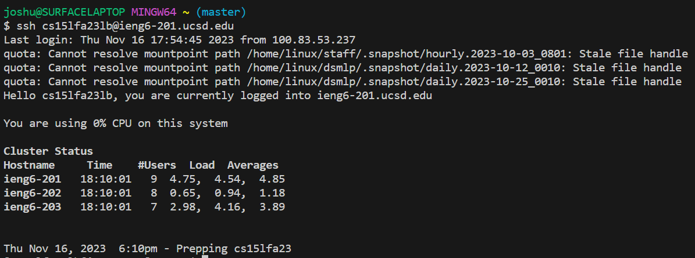
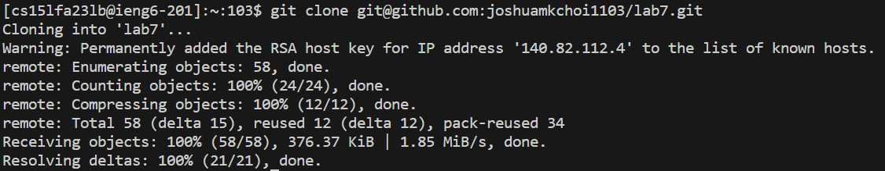
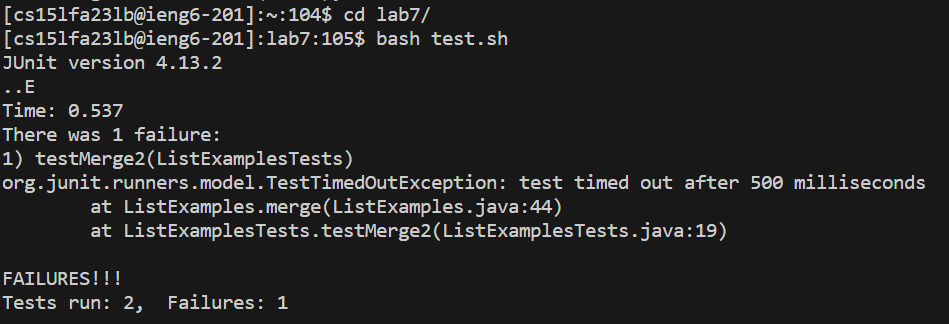

**LAB REPORT 4**
<br>
4. 
```ssh<Space>cs15lfa23lb@ieng6-201.ucsd.edu<Enter>```
<br>
5. 
```git<Space>clone<Space><Ctrl-V><Enter>```
<br>
6. 
```cd<Space>l<Tab><Enter>```, ```bash<Space>t<Tab><Enter>
<br>
7. 
