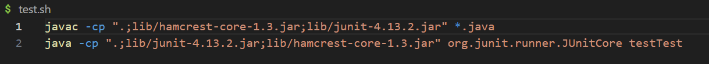

**Part 1 - Debugging Scenario** 
**Student:** I am not sure with what is wrong with my reverseArray method. Could it be possible that I am accessing an index that is out of bounds? 
  
  
  
  
  
**TA:** Take a look at your reverseArray method and see if you have an array of size 5 what the first iteration would do. If the array length is 5, can you access the index 5? 
**Student:** 

**Part 2 - Reflection** 
In the second half of this quarter, one thing I learned was how to use the VIM editor. I found it really cool that we don't need a code editor and we can edit code through the terminal window. For my CSE 12 class, I experimented with editing the code through VIM and running it through commands for fun and it was fascinating. Overall, I learned a lot from this class and my experience was wonderful with the help of the CSE 15L Staff!
